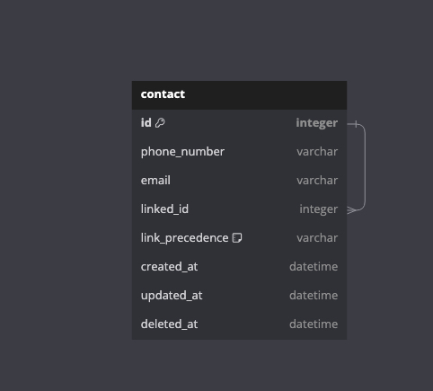

# Bitespeed Backend-Assignment

A web service with an endpoint /identify that will receive HTTP POST requests with
JSON body of the following format:

```
{
    "email"?: string,
    "phoneNumber"?: number
}
```

The web service should return an HTTP 200 response with a JSON payload containing the consolidated contact.
Your response should be in this format:

```
{
    "contact":{
        "primaryContatctId": number,
        "emails": string[], // first element being email of primary contact
        "phoneNumbers": string[], // first element being phoneNumber of primary conta
        "secondaryContactIds": number[] // Array of all Contact IDs that are "seconda
    }
}
```

## Architecture



## Run Locally

### Clone the project

```bash
git clone https://github.com/anuj-thakur-513/Bitespeed-Backend-Assignment.git
```

### Go to the project directory

```bash
cd Bitespeed-Backend-Assignment
```

### Install dependencies

```bash
npm install
```

### Change `.env.example` to `.env` and update the variables in the file

### Replace `./prisma/example_key.pem` with your own DB key

### Spin up the Server on PORT 8000

```bash
npm start or npm run dev
```

## API Reference

```http
  POST /identify
```

| Parameter     | Type     | Description                                     |
| :------------ | :------- | :---------------------------------------------- |
| `email`       | `String` | Email of the user passed in request body        |
| `phoneNumber` | `String` | Phone Number of the user passed in request body |
